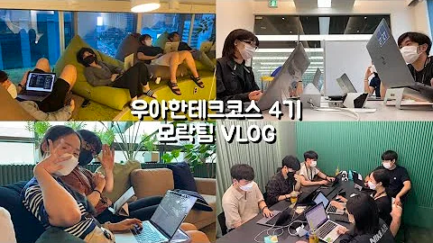
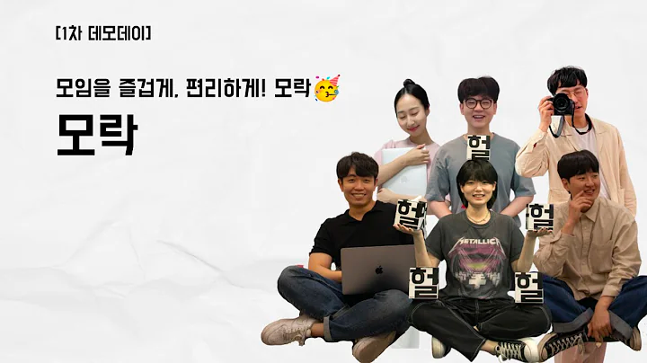
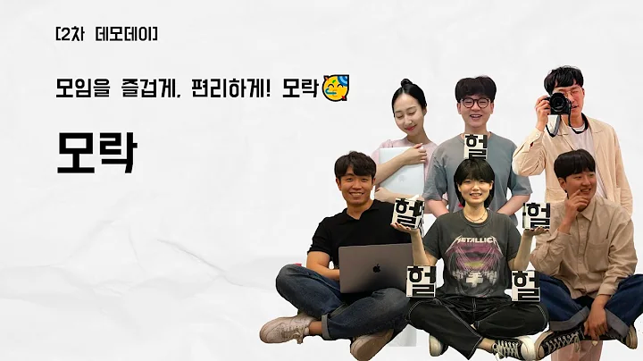

# morak-back

## 모락만사성
## 모락을 담다

### 모락 그림일지 

[모락의 브이로그](https://www.youtube.com/watch?v=sLBxjoZ6gKA)

### 모락 자랑일지

[1차 데모](https://www.youtube.com/watch?v=R7JO6cLeyhU)

- 모락 핵심 서비스 소개
- 모락의 팀 문화 및 규칙

[2차 데모](https://www.youtube.com/watch?v=G4uQTNYNanY)

- 계획한 이슈 목록, 완료 목록
- 브랜치 전략
- API 설계
- 배포 자동화

[3차 데모](https://www.youtube.com/watch?v=RSkr2x3n9B8)

- API 문서화
- 테스트 전략
- 시맨틱 버저닝
- 로깅 및 https 적용

[4차 데모](https://www.youtube.com/watch?v=u_INarrFVZ0)

- 프론트 성능 리포트 및 테스트 자동화
- 코드 정적 분석 리포트
